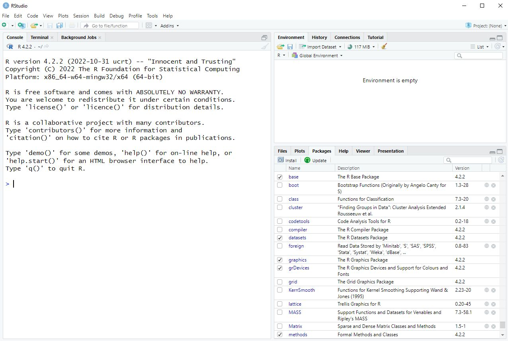

```{r setup, include=FALSE}
knitr::opts_chunk$set(echo = TRUE)
```

## Download and Install R
 
**Windows**:

1. go to https://cloud.r-project.org/bin/windows/base/
2. click the "Download R 4.3.1 for Windows" link.
3. When the file finishes downloading, double-click to install. You should be able to just click "Next" to all dialogs to finish the installation.
 
**Mac**:

1. go to https://cloud.r-project.org/bin/macosx/
2. click either "R-4.3.1-arm64.pkg" or "R-4.3.1-x86_64.pkg" depending on your operating system.
    * Select "R-4.3.1-arm64.pkg" if you're using macOS 11 (Big Sur) or higher on a M1 or higher Mac.
    * Select "R-4.3.1-x86_64.pkg" if you're using macOS 10.13 (High Sierra) or higher on an Intel Mac.
    * If you're not sure which to choose, visit [this page](https://support.apple.com/en-us/HT201581) to find out what kind of operating system and chip set your Mac has.
3. When the file finishes downloading, double-click to install. You should be able to just click "Next" to all dialogs to finish the installation.
 
**Linux**:

1. Go to https://cloud.r-project.org/bin/linux/
2. Go to the folder that most closely matches your distribution
3. Follow the directions to install.
 
## Download and Install RStudio Desktop
 
1. go to https://posit.co/download/rstudio-desktop/
2. Click the Blue button under "2: Install RStudio"
3. When the file finishes downloading, do what you would normally do to install a program on your system
4. Start RStudio and ensure it opens with no error messages. You should see something similar to the image below.
 
NOTE: **The current version of RStudio requires macOS 11+.** If you are running an older version of macOS (e.g., High Sierra, 10.13), you will need to download an older version of RStudio from [this page](https://docs.posit.co/previous-versions/rstudio/) (e.g., [RStudio 2021.09.4](https://dailies.rstudio.com/version/2021.09.4+403.pro3/))



## Download and Install R Packages

R packages are collections of functions that extend the capabilities of R. Many packages are available through [https://cran.r-project.org/index.html](CRAN), the Comprehensive R Archive Network. Below are instructions for installing R packages from CRAN using RStudio. 

1.	Open RStudio
2.	In the menu, go to Tools...Install Packages.
3.	In the Packages field enter the package name(s); separate multiple packages by space or comma
4.	Click Install


## Update R

You don't actually "update" R, you install a new version. R is designed such that multiple versions can be installed side-by-side. If you only want the latest version of R installed, here's one approach to take:

1. Uninstall the current version of R on your computer.
2. Download the most recent version of R and install it.
3. Open RStudio and click the Update button on the Packages tab to update packages.

## Update RStudio

RStudio will usually notify you when updates are available. The easiest thing to do is to click the "Quit and Download..." button on the notification and install the new version. Unlike R, this will overwrite the previous installation with the new installation. This is probably what you want. Unless you're a developer, you probably don't want multiple versions of RStudio on your computer. 

You can also go to "Help...Check for Updates..." to see if there is a new version of RStudio available. 

## Update R packages

Many of the more popular R packages are under active development and updated on a regular basis. To check for and install package updates:

1.	Open RStudio
2.	In the menu, go to "Tools...Check for Package Updates..."
3.	If new versions are available for packages you already have installed, they will be presented in a window 
4.	It's probably easiest to just click Select All and then click Install Updates. That will update all packages.
5.	If you get a message that asks "Do you want to install from sources the packages which need compilation?", the easiest thing to do is click No. See [this discussion](https://community.rstudio.com/t/meaning-of-common-message-when-install-a-package-there-are-binary-versions-available-but-the-source-versions-are-later/2431) for an explanation of the difference between clicking Yes or No.

